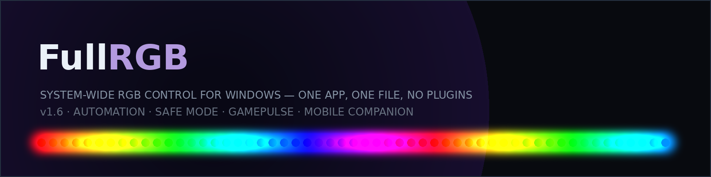

<p align="center">
  
</p>

# FullRGB

**System-wide RGB control for Windows — one app, one file, no plugins.**

[](https://github.com/ScannerVpn/FullRGB/actions/workflows/windows-build.yml)
[](https://github.com/ScannerVpn/FullRGB/releases/latest)
[](LICENSE)

[فارسی](#فارسی) · [English](#english) · [Docs site](https://scannervpn.github.io/FullRGB/)

---

## English

### What is it?
WPF (.NET 8, single-file `FullRGB.exe`) that drives **every RGB device** detected on the PC at once — motherboard headers, RAM, coolers, fans, LED strips — with software effects, without asking the user to install plugins.

- **Single file:** `FullRGB.exe` ~84 MB, self-contained. The OpenRGB engine is **embedded inside the exe** (`FullRGB.engine.zip` 13 MB) and unpacked once to `%LOCALAPPDATA%\FullRGB\engine\<hash>\`. No `vendor\` folder to ship.
- **Bilingual:** English / فارسی (RTL).
- **Compact UI:** 4 tabs — Lighting / Devices / Hardware / Settings — with live hero preview (same `EffectRenderer` as hardware).
- **Tray + autostart:** closing the window parks to tray; autostart via Scheduled Task `/RL LIMITED` (no admin).
- **Profiles + per-zone/per-device overrides**, importable/exportable as files or `FRGB1-…` share codes.

### Features
- **19 effects:** Solid, Gradient, Rainbow, ColorCycle, Breathing, Wave, Comet, Blink, Fire, Temperature (CPU/GPU), AudioVU (bass/mid/treble/level), Custom, Spectrum, Scanner, Sparkle, Plasma, Ambient (per-zone screen mirror), Gaming (screen average + hit flash), **GamePulse** (reacts to game events)
- Real FFT audio pipeline with noise gate (`level<=0.02 → black`)
- **Automation:** CLI one-shots (`FullRGB.exe --set-profile gaming`), named pipe `\\.\pipe\fullrgb-ctrl`, local HTTP API (`127.0.0.1:9372`, token-gated), **mobile companion page** (PIN + token on the LAN) — one command set, [full reference in the docs](docs/automation.md)
- **GamePulse:** feed it `hp`, `hit`, `death`, `heal`, `levelup`… from any tool that can POST or run a CLI — the body colour follows health, hits flash white, deaths pulse red
- **Time schedule:** `22:00-07:00=Night` rules (weekday-aware, overnight ranges); **per-app profiles:** focus `cyberpunk2077.exe` → your Gaming profile
- **Self-healing:** frame watchdog, wake-up rebuild, and **engine safe mode** — if the engine keeps dying the lights park on a dim static colour, a banner explains it, and a backoff retry restores your profile by itself
- **Auto-update:** daily GitHub Releases check, SHA-256-verified download, atomic self-swap at next start
- **Diagnostics:** Hardware → *Export diagnostics* builds a zip (system, support matrix, controllers, logs, settings) for bug reports
- Per-device colour calibration (R/G/B gain + gamma) — fixes "same colour looks different on pump vs fans"
- Per-zone LED count (resizable Addressable zones)
- Hardware audit page: Controlled / Needs elevation / Unsupported / Unknown — with VID:PID and **why** a device is missing
- **Community HID protocols (experimental):** import shared JSON definitions to probe driverless OEM mice/keyboards (read-only by default; writes triple-gated)

### Screenshots

Real UI captures (from `FullRGB.exe --uishot`) live in [`docs/screenshots/`](docs/screenshots).

| | |
|---|---|
|  |  |

### Supported hardware — does it detect *any* brand?
**Per-model, not per-brand.** FullRGB bundles OpenRGB (≈2361 detectors). Broadly covered: ASUS / MSI / Gigabyte / ASRock motherboards, Corsair Commander Core/Pro, G.Skill/Kingston/Corsair RAM, Razer/Logitech/SteelSeries mainstream, hubs. See the community [compatibility list](COMPATIBILITY.md).

- **RGB RAM / some GPUs need one extra step:** `Hardware → Unlock more hardware` registers the engine as an elevated on-demand Scheduled Task (`FullRGB-Engine`, `RunLevel=Highest`). One UAC prompt ever; FullRGB itself stays `asInvoker`. Without it only 2 devices appear, with it 4 (e.g. 2× ENE DRAM + board + cooler = 730 LEDs on the test rig). [Why?](https://scannervpn.github.io/FullRGB/troubleshooting)
- **Cheap OEM mouse/keyboard** (e.g. CASUE `2A7A:939F`, INSTANT `30FA:1140`) usually has **no driver** — each vendor uses its own undocumented HID reports. They appear as "Detected, not controllable" with VID:PID — safe, just lighting stays on firmware. Writing a guessed protocol risks bricking, so FullRGB probes read-only; community protocol files can add guarded support ([how it works](docs/hid-protocols.md)).

### Automation in 10 seconds
```powershell
FullRGB.exe --status                      # JSON summary
FullRGB.exe --set-profile gaming          # switch profile
FullRGB.exe --game-event hp 0.42          # drive the GamePulse effect
# or from any script:
Invoke-RestMethod "http://127.0.0.1:9372/api/event?token=$tok" -Method Post -Body '{"event":"hit"}' -ContentType 'application/json'
```
The token is in `%APPDATA%\FullRGB\api-token`; the mobile companion pairs with a PIN shown in Settings. [Docs → automation](docs/automation.md).

### Install (for testers)
1. Download `FullRGB.exe` from the latest Release (below) — updates after that arrive in-app.
2. Run it — no installer, no admin required.
3. If you have RGB RAM, go to `Hardware → Unlock more hardware → Enable RGB RAM` (one UAC). Rescan if needed.
4. `Settings → Start with Windows` if you want autostart. `Settings → Mobile companion` to control it from your phone.

### Build from source
```powershell
git clone https://github.com/ScannerVpn/FullRGB.git
cd FullRGB
# vendor/OpenRGB/OpenRGB Windows 64-bit/ must be present (58 MB, already in repo)
dotnet build -c Debug
bash tools/verify.sh Debug          # rendertest + uitest + fxtest
dotnet publish -c Release -r win-x64 -p:PublishDir=dist\ --nologo -v q
.\dist\FullRGB.exe                  # or --rendertest / --uitest / --uishot / --fxtest / --help
```

### Project layout
```
FullRGB/
├─ PLAN.md                     ← handoff doc: read this first
├─ CHANGELOG.md                ← what shipped in each version
├─ COMPATIBILITY.md            ← community device list (submit yours!)
├─ CONTRIBUTING.md / CODE_OF_CONDUCT.md
├─ docs/                       ← documentation site (GitHub Pages) + examples
├─ .github/workflows/          ← windows-build.yml (CI: gates + single-file publish), docs-site.yml (Pages)
├─ src/FullRGB/                ← WPF app (net8.0-windows)
│  ├─ SDK/EngineBundle.cs      ← embed/extract engine
│  ├─ SDK/OpenRgbProcessManager.cs
│  ├─ Setup/EngineTask.cs      ← elevated task for SMBus
│  ├─ Setup/EngineSafeMode.cs  ← crash-loop detector → safe mode + backoff
│  ├─ Automation/              ← CLI/pipe/HTTP control bus
│  ├─ Companion/               ← embedded mobile companion page
│  ├─ Update/AppUpdater.cs     ← GitHub Releases auto-update
│  ├─ Hid/                     ← community protocol system (guarded)
│  ├─ Diag/                    ← USB scan, support matrix, app log, diagnostics export
│  └─ Effects/EffectEngine.cs
├─ vendor/OpenRGB/...          ← engine source tree (zipped at build)
└─ tools/verify.sh, grab.ps1, uiclick.ps1, anim.ps1
```

### Community
- [Compatibility list](COMPATIBILITY.md) — search before reporting; add your device with the [device-report template](.github/ISSUE_TEMPLATE/device-report.yml)
- [CONTRIBUTING.md](CONTRIBUTING.md) — build, gates, code map, ground rules
- [Code of Conduct](CODE_OF_CONDUCT.md) — Contributor Covenant v2.1
- [Documentation site](https://scannervpn.github.io/FullRGB/) — automation reference, scheduling, community protocols, troubleshooting

### Releases
Grab `FullRGB.exe` from [Releases](https://github.com/ScannerVpn/FullRGB/releases/latest).
Builds are produced by CI (`windows-build.yml`) which runs `--rendertest` + `--uitest` and
verifies the embedded engine is present before attaching the exe. The in-app updater only
trusts the `FullRGB.exe` asset of this repo's latest release.

### Security notes

- **Auto-update integrity vs. authenticity.** The updater downloads over HTTPS and verifies the
  file's SHA-256 — but that hash is *self-referential*: it is compared against the hash recorded
  at download time, so it catches corruption or tampering between download and apply, **not** a
  malicious asset published by a compromised GitHub account. Real authenticity needs Authenticode
  code-signing of the released exe (planned; not yet in place). Until then, only install from the
  official Releases page and treat any other mirror as untrusted.
- **Rollback.** After a self-swap the previous build is kept as `FullRGB.exe.old` and only
  deleted once the new build has started cleanly twice. If a new build fails to start, the `.old`
  file is still there next to the exe and can be renamed back over it.
- **Mobile companion is plain HTTP.** The companion server has no TLS: the PIN and the session
  token travel in cleartext, so anyone on the same network can read them. Enable it only on a
  trusted home network, never on public or shared Wi-Fi. It is off by default, and the HTTP API
  binds to loopback unless you turn the companion on.
- **Community protocol writes** are gated behind a global switch plus two confirmations per test
  paint (the second one typed). See the risk section in [COMPATIBILITY.md](COMPATIBILITY.md).

---

## فارسی

### این برنامه چیست؟
اپ WPF (.NET 8, تک‌فایل `FullRGB.exe`) که همه قطعات RGB سیستم را یکجا کنترل می‌کند — هدرهای مادربرد، رم، کولر، فن، نوار LED — بدون نیاز به نصب پلاگین.

- **تک‌فایل:** حدود ۸۴ مگ، خودکفا. موتور OpenRGB داخل خودِ exe جاسازی شده و فقط یک‌بار در `%LOCALAPPDATA%\FullRGB\engine\...` باز می‌شود.
- **دو زبانه:** فارسی / انگلیسی، راست‌به‌چپ کامل.
- **رابط فشرده:** ۴ تب — نورپردازی / دستگاه‌ها / سخت‌افزار / تنظیمات

### امکانات (نسخه ۱.۶)
- **۱۹ افکت:** از تک‌رنگ و موج و آتش تا موزیک (FFT واقعی)، Ambient (آینه صفحه) و **GamePulse** (واکنش به رویدادهای بازی)
- **اتوماسیون:** `FullRGB.exe --set-profile gaming` از خط فرمان + Named Pipe + API محلی (`127.0.0.1:9372`) + **صفحه کنترل موبایل** (پین + توکن روی LAN) — [مرجع کامل](docs/automation.md)
- **زمان‌بندی:** `22:00-07:00=شب` — پروفایل‌ها بر اساس ساعت روز و روز هفته؛ **پروفایل هر برنامه:** باز شدن بازی → پروفایل خودش
- **ترمیم خودکار:** watchdog فریم‌ها، بازسازی بعد از خواب/بیدار شدن، و **حالت ایمن** — اگر موتور مدام قطع شود، نورها روی رنگ ثابت کم‌نور پارک می‌شوند و برنامه با تأخیر فزاینده خودش درستشان می‌کند
- **به‌روزرسانی خودکار:** بررسی روزانه GitHub Releases، دانلود تأییدشده با SHA-256، جایگزینی امن در استارت بعدی
- **خروجی عیب‌یابی:** یک دکمه در سخت‌افزار — زیپ شامل سیستم، ماتریس پشتیبانی، کنترلرها، لاگ‌ها و تنظیمات برای گزارش باگ
- **اشتراک پروفایل:** خروجی/ورودی فایل + کد کوتاه `FRGB1-…` برای فرستادن در چت
- **پروتکل‌های اجتماعی HID (آزمایشی):** فایل JSON مشترک برای موس/کیبوردهای بی‌درایور — پیش‌فرض فقط خواندن؛ نوشتن سه لایه گارد دارد

### نصب برای تست
۱. از بخش Releases فایل `FullRGB.exe` را دانلود کن — به‌روزرسانی‌های بعدی داخل خود برنامه می‌آیند
۲. اجرا کن — نیاز به نصب یا ادمین ندارد
۳. اگر رم RGB داری: `سخت‌افزار → فعال‌سازی سخت‌افزار بیشتر → فعال‌سازی نور رم` (فقط یک بار تایید ویندوز)
۴. `تنظیمات → شروع با ویندوز` و `تنظیمات → همراه موبایل` برای کنترل با گوشی

### پوشش سخت‌افزار
برای هر **مدل** باید درایور نوشته شده باشد، نه هر برند. مادربردهای اصلی، رم‌ها، کنترلر Corsair پوشش خوبی دارند؛ موس/کیبوردهای ارزان OEM معمولا ندارند چون هرکدام پروتکل اختصاصی بدون مستند دارد — [لیست سازگاری](COMPATIBILITY.md) را ببین و دستگاهت را اضافه کن.

---

## License

MIT — see `LICENSE` (OpenRGB engine inside is GPL-2.0, bundled as separate binary).
